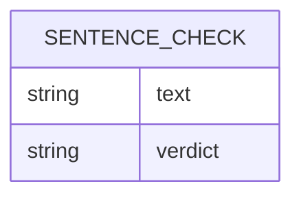

# Domain Model

The domain is intentionally thin: a single transient entity carries each check from
submission to verdict. Nothing is persisted — the entity exists only for the
duration of one request/response exchange.

**SentenceCheck** — the sentence text a User submits, and the agent's verdict
(`rude` or `not rude`) for it. It is never stored: the webapp holds it only
long enough to show the result, and the agent keeps no record of it after
replying.