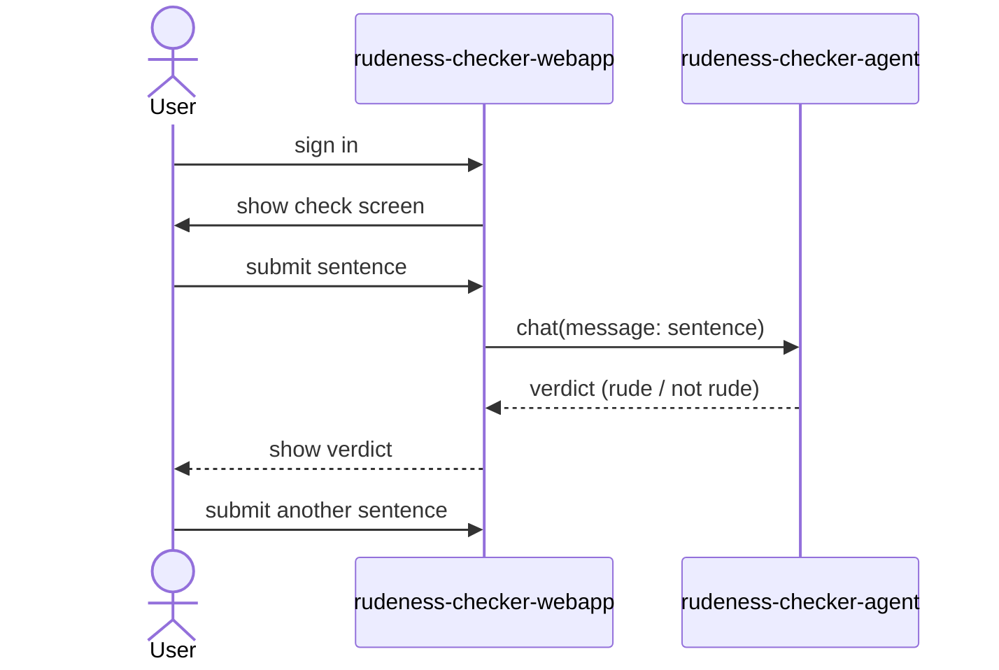

# Check a sentence for rudeness

A signed-in User types a sentence and the agent tells them whether it is rude.

```mermaid
sequenceDiagram
    actor User
    participant rudeness-checker-webapp
    participant rudeness-checker-agent

    User->>rudeness-checker-webapp: sign in
    rudeness-checker-webapp->>User: show check screen
    User->>rudeness-checker-webapp: submit sentence
    rudeness-checker-webapp->>rudeness-checker-agent: chat(message: sentence)
    rudeness-checker-agent-->>rudeness-checker-webapp: verdict (rude / not rude)
    rudeness-checker-webapp-->>User: show verdict
    User->>rudeness-checker-webapp: submit another sentence
```

